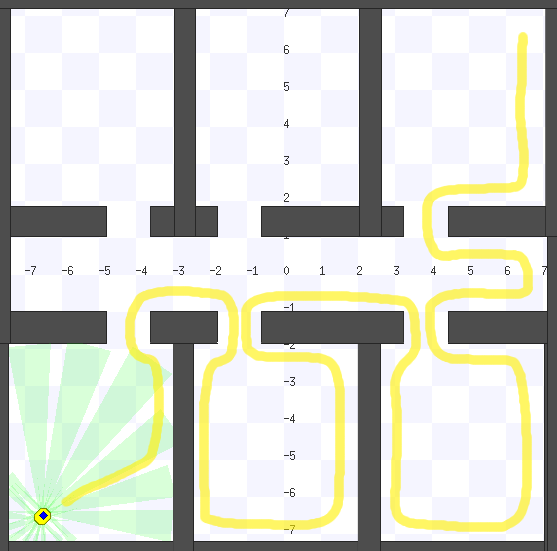

# Mobile Robots - Homework assignment

## Wallfollower

This week's programming homework is to develop a
[SMACH](http://www.ros.org/wiki/smach) state machine that implements
wallfollowing behavior for the youBot equipped with Pioneer sonars. The robot
should be able to move from the initial position in the bottom left corner to
the target in the top right corner, as shown in the figure below. You do not
need to follow the indicated path - this is just an example of a correctly
working, right-hand side wallfollowing robot.

## Remarks

You are supposed to implement the required functionality within the
**amr_bugs** package. As usually, most of the infrastructure code is
provided. You will have to fill the missing code in the file
"**amr_bugs/src/amr_bugs/wallfollower_state_machine.py**", where the SMACH state
machine is constructed.

You may use **wallfollower.launch** launch script
to start the simulation and bring up the _**wallfollower.py**_ node, dynamic
reconfiguration GUI, and SMACH viewer. Please note that the launch file will
load the **rooms** world, which is especially convenient for debugging the
wallfollowing behavior. However you should also make sure that your
implementation works in **simple** world.

This is an individual assignment, no group work allowed.

## Grading

The following aspects will be considered while grading your homework:

1. Quality of documentation and comments
2. Basic wall-following:
  * Finds a wall
  * Follows a straight wall
3. Advanced wall-following:
* Handles concave corners
* Handles convex corners or doors
4. Support of dynamic reconfiguration of clearance and mode
