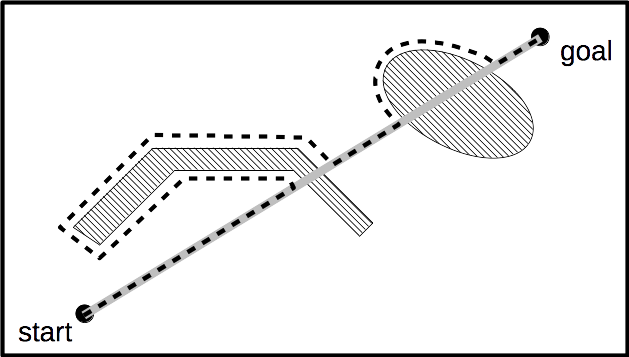

# Mobile Robots - Homework assignment

## Bug2

This week you will implement the Bug2 algorithm, which belongs to the family of
local obstacle avoidance algorithms. As such, it does not depend on the
environment map, but rather uses robot's local sensor readings and approximate
information regarding the direction of the goal to decide where to go. The figure below demonstrates one possible path that the robot could choose
if controlled by this algorithm.

||
|:--:|
|Fig.1 - Example path of a correctly working Bug2 algorithm with right-hand side wall-following|

Here is a short summary of the Bug2 algorithm:

* Move straight to the goal position
* Bump into an obstacle that blocks the way
* Record the current position and the goal position
* Enable wallfollowing behavior
* Follow the wall until cross the line from the recorded position to the goal (possibly extended to infinity)
* Continue to the goal

## Remarks

You are supposed to implement the required functionality within the
**amr_bugs** package. As usually, most of the infrastructure code is
provided, you do not need to touch the source code in the *bug2.py*
node. You have to complete the **BugBrain** class (in
**amr_bugs/src/amr_bugs/bug_brain.py**).

You may use **bug2.launch** launch script to start the simulation and bring
up the *bug2.py*, *wallfollower.py*, *motion_controller*, and *obstacle_detector* nodes. The launch
file will load the **walls** world, which has a weird-shaped obstacle, that
the correcly implemented Bug2 should be able to handle. The robot should be able
to reach e.g. position (-5,-5) from the spawn location. Further,
when commanded to go to e.g. position (-4,4), it should approach
the oval obstacle, make a full circle and then report "unreachable goal".

This is an individual assignment.

## Hints

As mentioned in the lab class, and as described in more detail in the
instructions in the source code, you can simplify debugging by creating member
variables inside **BugBrain** with names starting *wp_* (for "Way
Point") and *ln_* (for "Line"). In order to see the visualized points
and lines you will have to start **RViz** whith the following command:

```
roslaunch amr_ui rviz.launch config:=bug2
```

The config file has displays for *Marker* and *MarkerArray*
visualization messages set up to proper topics.

If your wallfollower does not work properly you can use the one from the *amr_binaries* package.
For this edit the file **bug2.launch** by replacing:

```
  <!-- Wallfollower node, start disabled -->
  <node pkg="amr_bugs" type="wallfollower.py" name="wallfollower" required="true">
```
 
 with
 
 ```
  <!-- Wallfollower node, start disabled -->
  <node pkg="amr_binaries" type="wallfollower" name="wallfollower" required="true">
 ```
 
## Grading

The following aspects will be considered while grading your homework:

* Quality of documentation and comments. (1 point)
* Can your **BugBrain** handle "simple" situations like in Figure 1? (2 points)
* Can your **BugBrain** handle complex obstacles like the one in the bottom of the **walls** world? (2 points)
* Can your **BugBrain** understand that a goal is unreachable? (1 point)
* If you choose to use the precompiled binaries you will receive 1 point less
